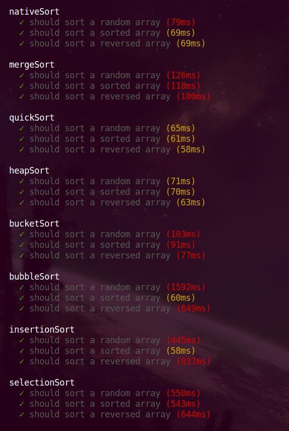

# JavaScript Sorting Algorithms

Some JavaScript implementations of various sorting algorithms. Mocha tests written for measuring the time each one takes to sort some arrays.



To run the tests:
```
npm install
npm test
```
